# SOC Automation Bot - Development Guide

**Version:** 1.1  
**Last Updated:** 2026-02-15

---

## Table of Contents
1. [Primary User Journey](#primary-user-journey)
2. [MVP Dataflow](#mvp-dataflow)
3. [Component Architecture Hierarchy](#component-architecture-hierarchy)
4. [Development Timeline](#development-timeline)
5. [State Management Flow](#state-management-flow)
6. [Development Strategy & Approach](#development-strategy--approach)
7. [Technical Priority Matrix](#technical-priority-matrix)
8. [Phase-by-Phase Implementation](#phase-by-phase-implementation)
9. [Flow Diagrams](#flow-diagrams)
10. [Development Environment Setup](#development-environment-setup)
11. [Testing Strategy](#testing-strategy)
12. [Deployment Strategy](#deployment-strategy)

---

## Primary User Journey

### SOC Analyst Alert Investigation Workflow

This diagram shows the primary user journey for a SOC analyst using the automation bot.

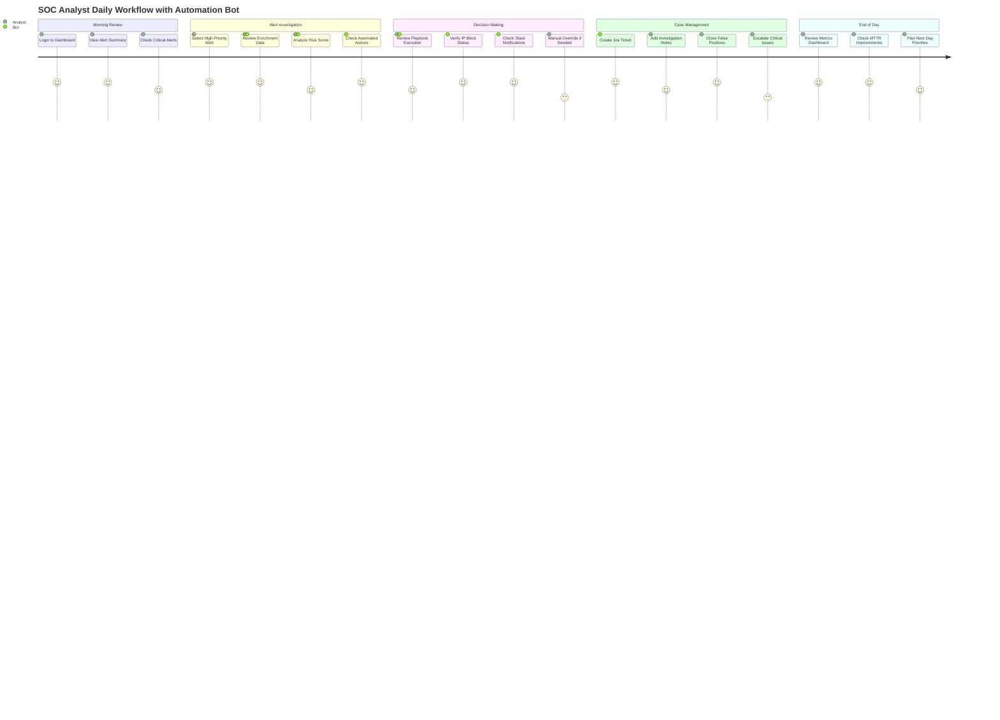

### Detailed User Flow (Alert Triage)

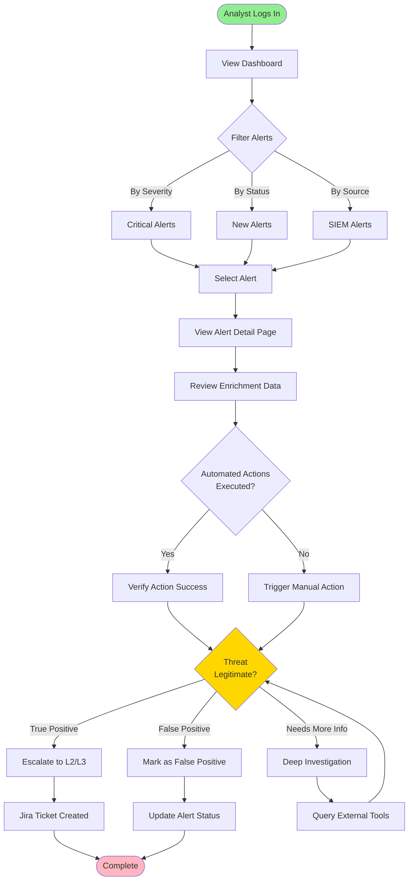

---

## MVP Dataflow

### End-to-End Data Flow (MVP)

This diagram shows how data flows through the entire system from alert ingestion to analyst review.

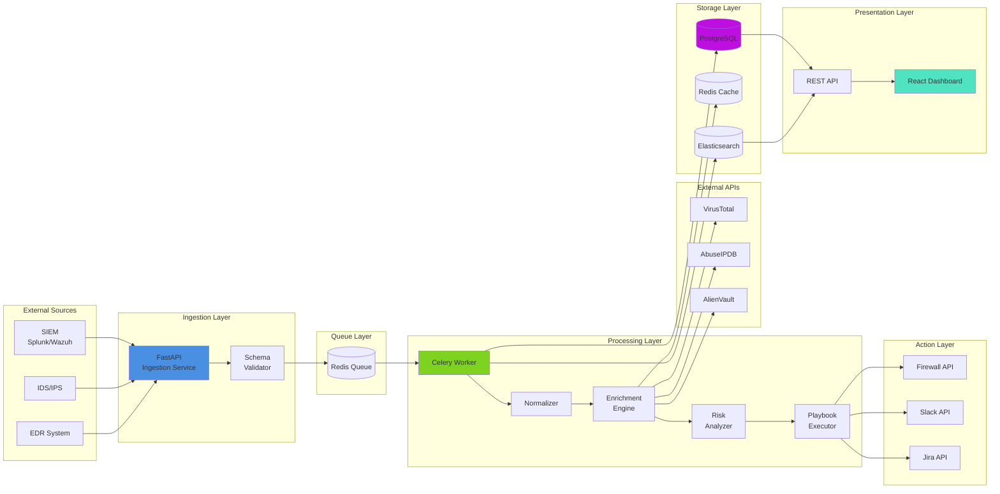

---

## Component Architecture Hierarchy

### System Component Hierarchy

```mermaid
graph TD
    Root[SOC Automation Bot]
    
    Root --> Frontend[Frontend Layer]
    Root --> Backend[Backend Layer]
    Root --> Data[Data Layer]
    Root --> External[External Integrations]
    
    Frontend --> UI[React Dashboard]
    UI --> Pages[Pages]
    UI --> Components[Components]
    UI --> State[State Management]
    
    Pages --> DashPage[Dashboard Page]
    Pages --> AlertPage[Alert Detail Page]
    Pages --> MetricsPage[Metrics Page]
    
    Components --> Table[Alert Table]
    Components --> Cards[Metric Cards]
    Components --> Charts[Charts]
    Components --> Actions[Action Buttons]
    
    State --> Redux[Redux Store]
    Redux --> AlertSlice[Alert Slice]
    Redux --> UserSlice[User Slice]
    
    Backend --> API[API Service]
    Backend --> Worker[Worker Service]
    Backend --> Core[Core Logic]
    
    API --> Routes[Route Handlers]
    API --> Auth[Authentication]
    API --> Middleware[Middleware]
    
    Routes --> AlertRoutes[Alert Routes]
    Routes --> MetricRoutes[Metric Routes]
    Routes --> ActionRoutes[Action Routes]
    
    Worker --> Tasks[Celery Tasks]
    Tasks --> ProcessTask[Process Alert Task]
    Tasks --> EnrichTask[Enrichment Task]
    Tasks --> ActionTask[Action Task]
    
    Core --> Modules[Modules]
    Modules --> Ingestion[Ingestion Module]
    Modules --> Normalization[Normalization Module]
    Modules --> Enrichment[Enrichment Module]
    Modules --> Analysis[Analysis Module]
    Modules --> Response[Response Module]
    
    Enrichment --> VTProvider[VirusTotal Provider]
    Enrichment --> ABProvider[AbuseIPDB Provider]
    Enrichment --> OTXProvider[OTX Provider]
    
    Response --> FirewallAction[Firewall Action]
    Response --> NotifyAction[Notification Action]
    Response --> TicketAction[Ticketing Action]
    
    Data --> Database[PostgreSQL]
    Data --> Cache[Redis Cache]
    Data --> Logs[Elasticsearch]
    
    Database --> Models[ORM Models]
    Models --> AlertModel[Alert Model]
    Models --> EnrichModel[Enrichment Model]
    Models --> ActionModel[Action Model]
    Models --> UserModel[User Model]
    
    External --> ThreatIntel[Threat Intel APIs]
    External --> ActionAPIs[Action APIs]
    External --> Monitoring[Monitoring Tools]
    
    ThreatIntel --> VT2[VirusTotal]
    ThreatIntel --> AB2[AbuseIPDB]
    
    ActionAPIs --> FW2[Firewall]
    ActionAPIs --> Slack2[Slack]
    ActionAPIs --> Jira2[Jira]
    
    style Root fill:#FF6B6B
    style Frontend fill:#4ECDC4
    style Backend fill:#95E1D3
    style Data fill:#F38181
    style External fill:#AA96DA
```

---

## Development Timeline

### 12-Week MVP Development Timeline

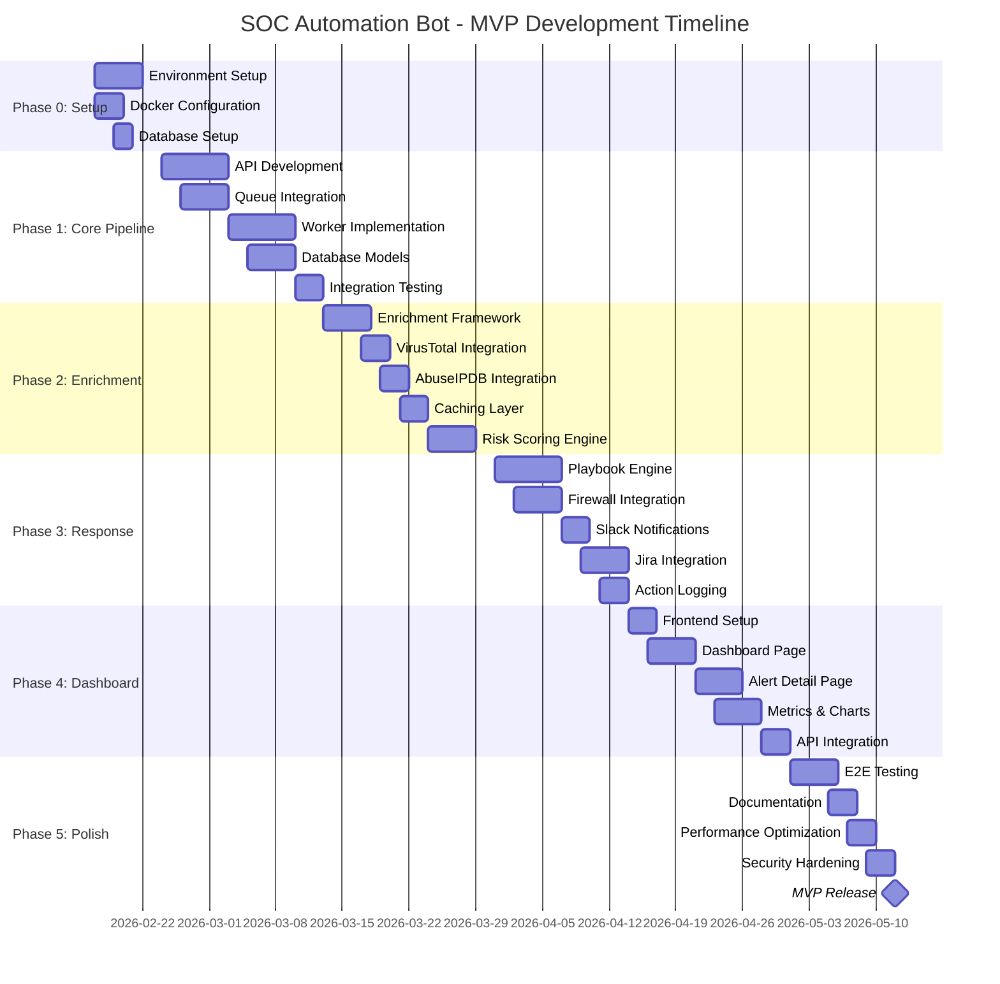

---

## State Management Flow

### Alert State Machine

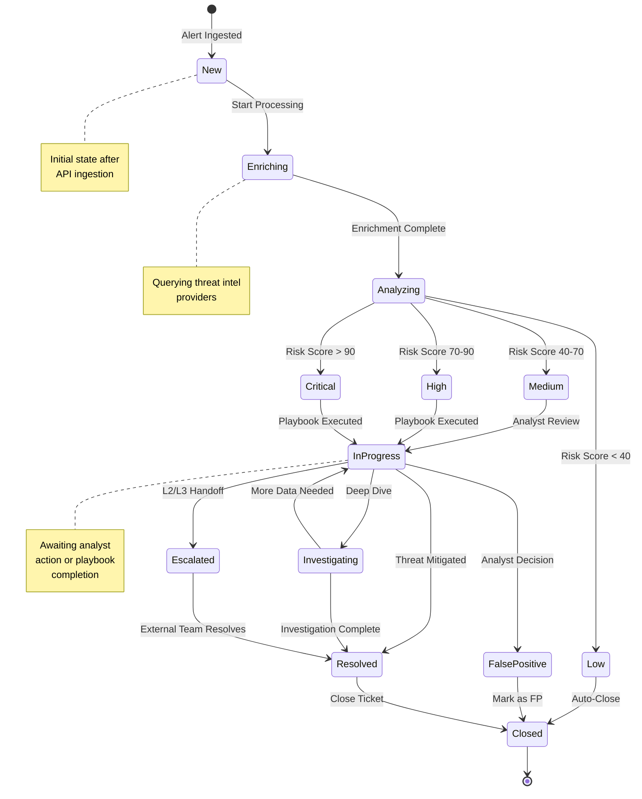

### Frontend State Management (Redux)

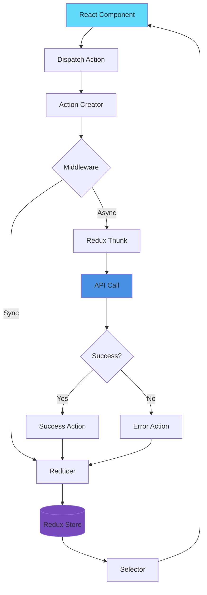

---

## Development Strategy & Approach

### Agile Development Strategy

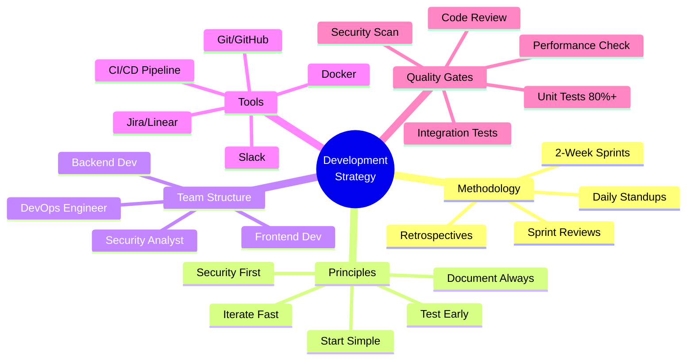

### Development Workflow

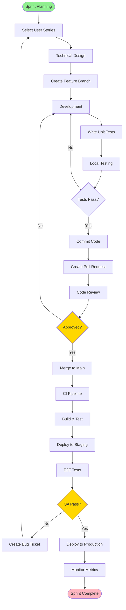

---

## Technical Priority Matrix

### Feature Priority Matrix (MoSCoW Method)

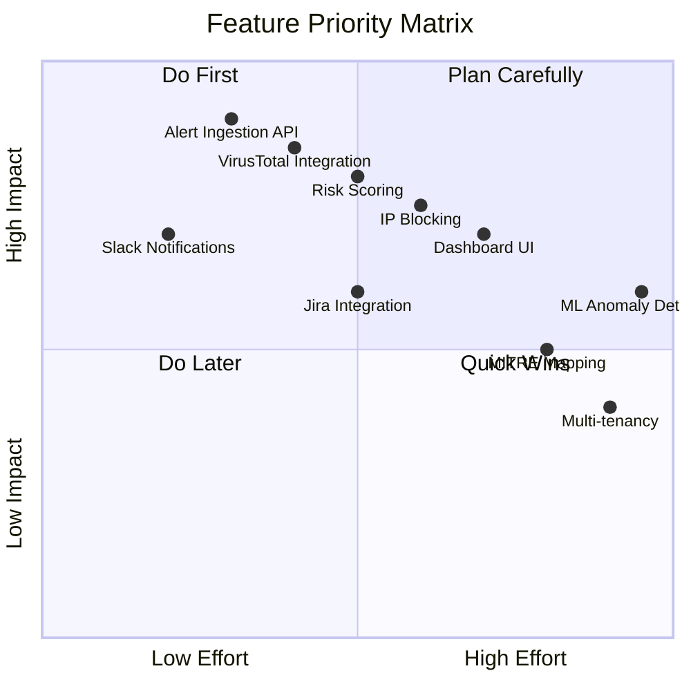

### Implementation Priority Table

| Priority | Feature | Complexity | Impact | Phase | Dependencies |
|----------|---------|------------|--------|-------|--------------|
| **P0** | Alert Ingestion API | Medium | Critical | 1 | None |
| **P0** | Database Models | Medium | Critical | 1 | None |
| **P0** | Celery Worker | Medium | Critical | 1 | Redis, DB |
| **P1** | VirusTotal Integration | Low | High | 2 | API Key |
| **P1** | Risk Scoring Engine | Medium | High | 2 | Enrichment |
| **P1** | Slack Notifications | Low | High | 3 | Webhook URL |
| **P2** | IP Blocking (iptables) | Medium | High | 3 | Firewall Access |
| **P2** | Dashboard UI | High | Medium | 4 | API Complete |
| **P2** | Jira Integration | Medium | Medium | 3 | Jira API |
| **P3** | AbuseIPDB Integration | Low | Medium | 2 | API Key |
| **P3** | Metrics & Charts | Medium | Medium | 4 | Dashboard |
| **P4** | MITRE ATT&CK Mapping | High | Low | 5 | Alert Data |
| **P4** | ML Anomaly Detection | Very High | Medium | 5 | Historical Data |

### Technical Debt vs Feature Development

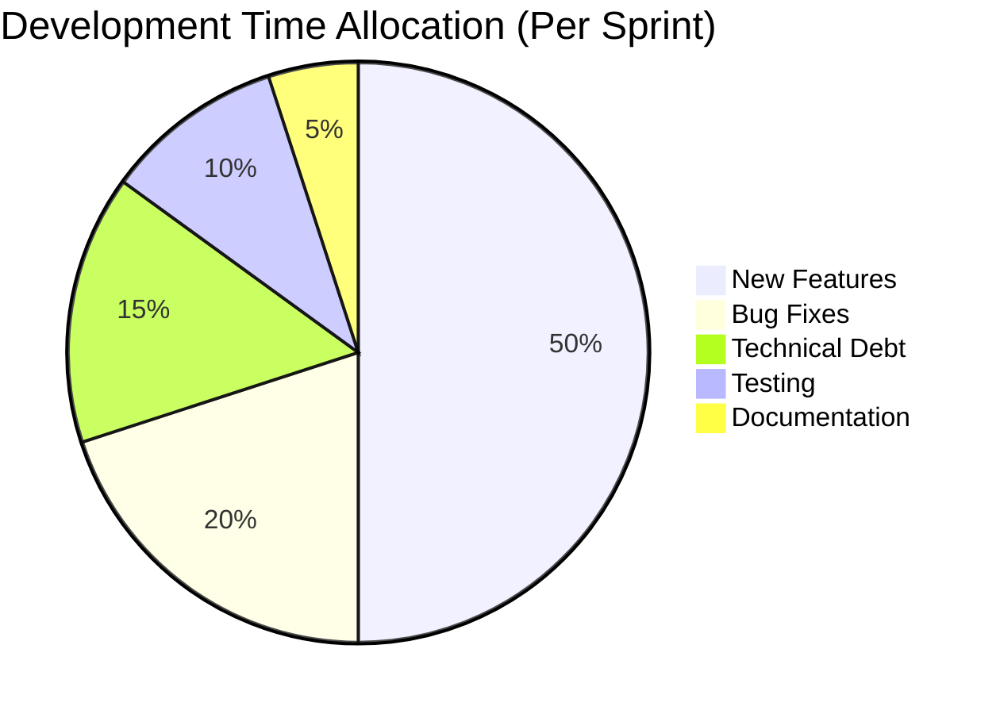

---

## Development Approach

### Recommended Development Methodology

**Iterative Agile Approach** with 2-week sprints focusing on vertical slices of functionality.

#### Core Principles
1. **Start Simple, Iterate Fast:** Build the simplest working version first
2. **Test Early, Test Often:** Write tests alongside code
3. **Document as You Go:** Update docs with each feature
4. **Security First:** Never defer security considerations

### Development Phases Overview

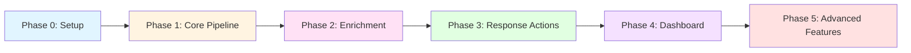

---

## Phase-by-Phase Implementation

### Phase 0: Environment Setup (Week 1)

**Goal:** Set up development infrastructure

#### Tasks
- [ ] Initialize Git repository
- [ ] Set up Python virtual environment
- [ ] Configure Docker & Docker Compose
- [ ] Set up PostgreSQL database
- [ ] Set up Redis
- [ ] Configure environment variables (`.env`)
- [ ] Create initial project structure

#### Deliverables
- Working `docker-compose.yml`
- Database migrations (Alembic)
- Basic README with setup instructions

---

### Phase 1: Core Pipeline (Weeks 2-3)

**Goal:** Build the alert ingestion and processing backbone

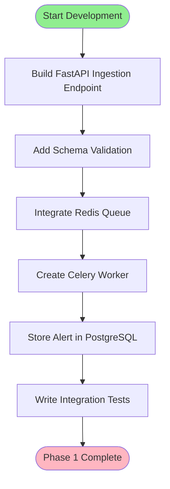

#### Key Components to Build
1. **API Layer** (`app/api/`)
   - `main.py`: FastAPI app initialization
   - `routes.py`: `/api/v1/alert` endpoint
   - `models.py`: Pydantic request/response models
   - `auth.py`: API key validation middleware

2. **Core Logic** (`app/core/`)
   - `celery_app.py`: Celery configuration
   - `tasks.py`: `process_alert` task

3. **Database** (`app/database/`)
   - `models.py`: SQLAlchemy Alert model
   - `crud.py`: Create/Read operations

#### Testing Checklist
- [ ] POST valid alert → Returns 202 with job_id
- [ ] POST invalid JSON → Returns 400
- [ ] POST without API key → Returns 401
- [ ] Worker processes alert and saves to DB

---

### Phase 2: Threat Intelligence Enrichment (Weeks 4-5)

**Goal:** Integrate external threat intel APIs

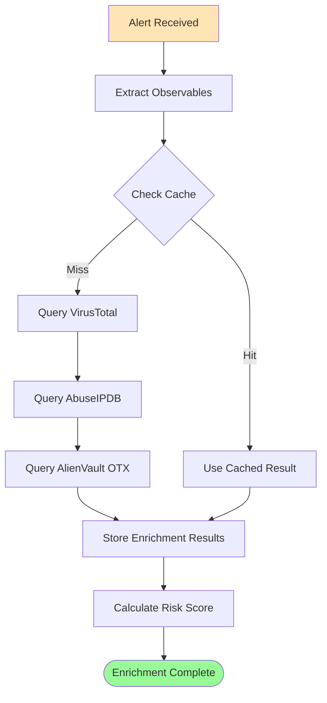

#### Key Components to Build
1. **Enrichment Module** (`app/modules/enrichment/`)
   - `base.py`: Abstract enrichment provider
   - `virustotal.py`: VirusTotal integration
   - `abuseipdb.py`: AbuseIPDB integration
   - `otx.py`: AlienVault OTX integration
   - `cache.py`: Redis caching layer

2. **Analysis Module** (`app/modules/analysis/`)
   - `risk_scorer.py`: Risk score calculation logic

#### Configuration Needed
```python
# .env
VIRUSTOTAL_API_KEY=your_key_here
ABUSEIPDB_API_KEY=your_key_here
OTX_API_KEY=your_key_here
ENRICHMENT_CACHE_TTL=86400  # 24 hours
```

#### Testing Checklist
- [ ] Extract IPs, domains, hashes from alert
- [ ] Query each TIP and get results
- [ ] Cache results in Redis
- [ ] Calculate accurate risk score
- [ ] Handle API rate limits gracefully

---

### Phase 3: Automated Response Actions (Weeks 6-7)

**Goal:** Implement playbook execution engine

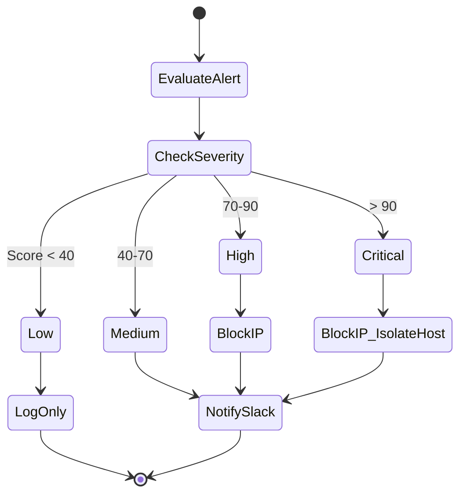

#### Key Components to Build
1. **Response Module** (`app/modules/response/`)
   - `base.py`: Abstract action executor
   - `firewall.py`: IP blocking (iptables/AWS SG)
   - `notification.py`: Slack/Email notifications
   - `ticketing.py`: Jira integration
   - `playbook_engine.py`: Playbook parser and executor

2. **Playbook Definition** (YAML format)
```yaml
# playbooks/high_severity_ip_block.yml
name: "Block Malicious IP"
trigger:
  severity: ["High", "Critical"]
  observable_type: "ip"
steps:
  - action: "block_ip_iptables"
    params:
      chain: "INPUT"
  - action: "notify_slack"
    params:
      channel: "#security-alerts"
```

#### Testing Checklist
- [ ] Parse YAML playbook correctly
- [ ] Execute actions in sequence
- [ ] Log action outcomes
- [ ] Handle action failures gracefully
- [ ] Test Slack notification delivery

---

### Phase 4: Web Dashboard (Weeks 8-9)

**Goal:** Build React-based monitoring UI

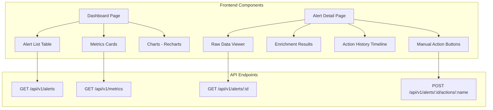

#### Key Components to Build
1. **Backend API Extensions**
   - Add pagination to alerts endpoint
   - Create metrics aggregation endpoint
   - Add manual action trigger endpoint

2. **Frontend** (`frontend/`)
   - `pages/Dashboard.jsx`: Main overview
   - `pages/AlertDetail.jsx`: Single alert view
   - `components/AlertTable.jsx`: Reusable table
   - `components/MetricsCard.jsx`: Stats display

#### Testing Checklist
- [ ] Dashboard loads and displays alerts
- [ ] Pagination works correctly
- [ ] Alert detail page shows all data
- [ ] Manual actions can be triggered
- [ ] Real-time updates (WebSocket/polling)

---

### Phase 5: Advanced Features (Weeks 10+)

**Goal:** Add production-ready features

#### Features to Implement
1. **Human-in-the-Loop Approvals**
   - Slack interactive buttons
   - Approval workflow state machine

2. **Alert Correlation**
   - Group related alerts
   - Pattern detection

3. **MITRE ATT&CK Mapping**
   - Tag alerts with tactics/techniques
   - Visualization of attack chain

---

## Flow Diagrams

### Enrichment Flow (Detailed)

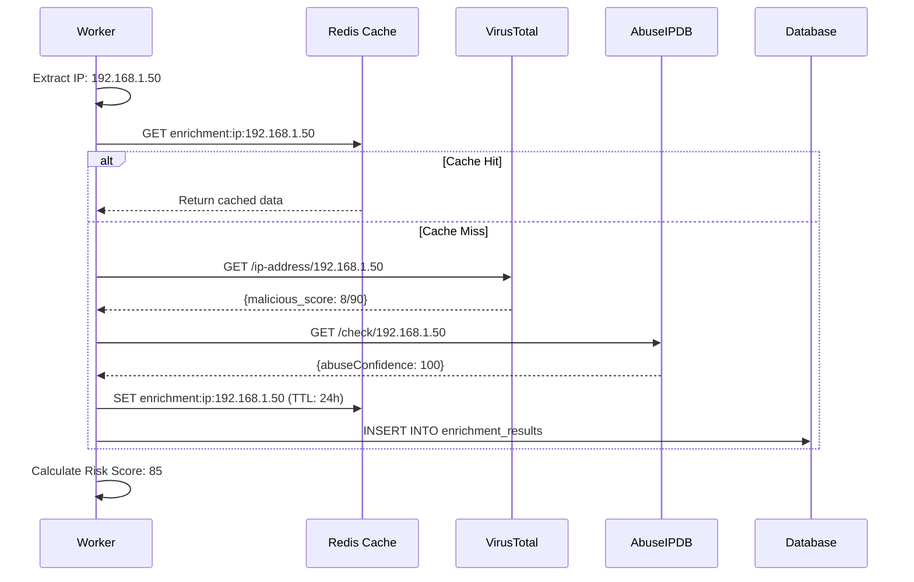

### Playbook Execution Flow

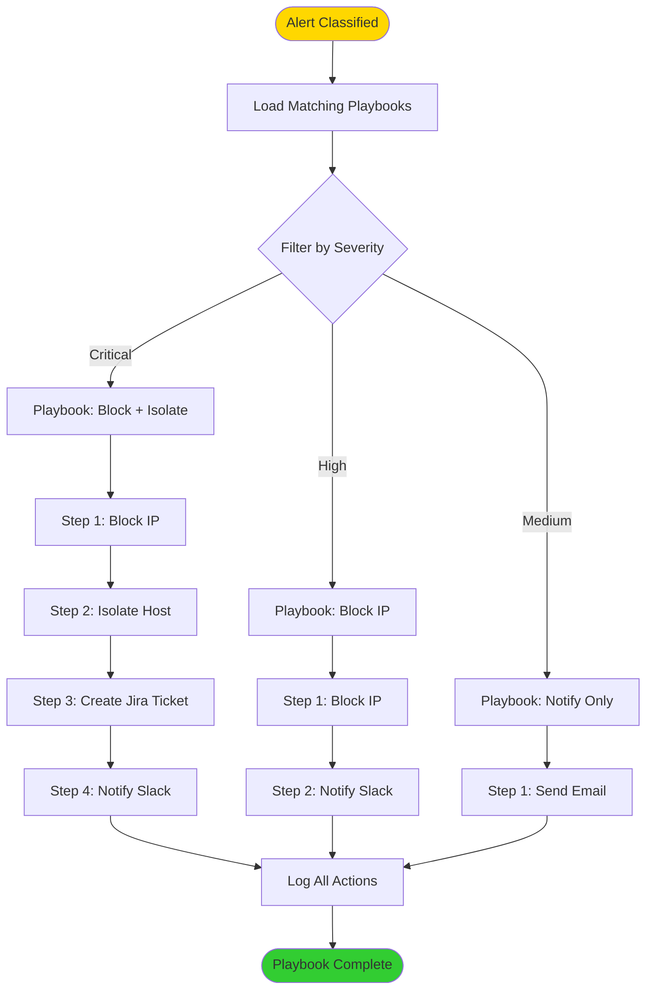

### Deployment Architecture

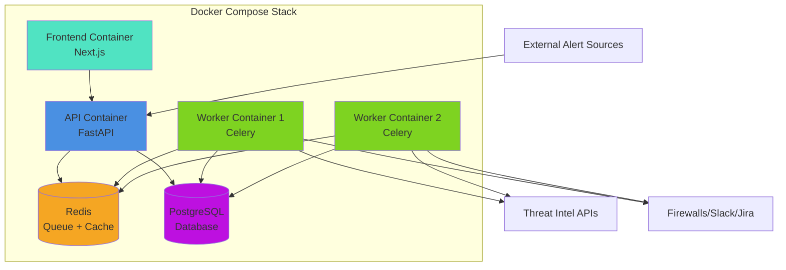

---

## Development Environment Setup

### Prerequisites
- Python 3.11+
- Docker & Docker Compose
- Node.js 18+ (for frontend)
- Git

### Initial Setup Commands

```bash
# Clone repository
git clone <repo-url>
cd soc-automation-bot

# Create Python virtual environment
python -m venv venv
source venv/bin/activate  # Windows: venv\Scripts\activate

# Install dependencies
pip install -r requirements.txt

# Set up environment variables
cp .env.example .env
# Edit .env with your API keys

# Start infrastructure
docker-compose up -d postgres redis

# Run database migrations
alembic upgrade head

# Start API server (development)
uvicorn app.api.main:app --reload --port 8000

# Start Celery worker (separate terminal)
celery -A app.core.celery_app worker --loglevel=info

# Start frontend (separate terminal)
cd frontend
npm install
npm run dev
```

---

## Testing Strategy

### Test Pyramid

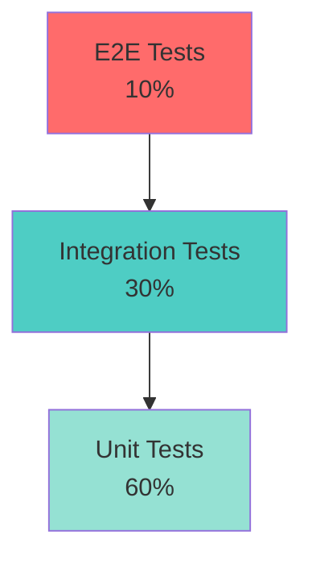

### Unit Tests
- Test individual functions (enrichment, scoring, parsing)
- Mock external API calls
- Fast execution (< 1 second total)

### Integration Tests
- Test API endpoints with real database
- Test Celery task execution
- Use Docker containers for dependencies

### E2E Tests
- Simulate full alert lifecycle
- Test UI interactions (Playwright/Cypress)
- Run in staging environment

### Example Test Structure
```python
# tests/unit/test_risk_scorer.py
def test_calculate_risk_score_high_threat():
    alert = {
        "severity": "High",
        "enrichment": {"vt_score": 10, "abuse_confidence": 100}
    }
    score = calculate_risk_score(alert)
    assert score >= 70

# tests/integration/test_alert_ingestion.py
def test_post_alert_creates_db_record(client, db_session):
    response = client.post("/api/v1/alert", json=sample_alert)
    assert response.status_code == 202
    alert = db_session.query(Alert).first()
    assert alert is not None
```

---

## Deployment Strategy

### Development
- Local Docker Compose
- Hot reload enabled
- Debug logging

### Staging
- AWS ECS or DigitalOcean App Platform
- Separate database instance
- Real external API integrations

### Production
- Kubernetes cluster (optional for scale)
- High availability (3+ worker replicas)
- Monitoring: Prometheus + Grafana
- Logging: ELK Stack
- Secrets: AWS Secrets Manager / HashiCorp Vault

### CI/CD Pipeline

```mermaid
flowchart LR
    A[Git Push] --> B[GitHub Actions]
    B --> C[Run Tests]
    C --> D{Tests Pass?}
    D -->|Yes| E[Build Docker Images]
    D -->|No| F[Notify Developer]
    E --> G[Push to Registry]
    G --> H[Deploy to Staging]
    H --> I[Run E2E Tests]
    I --> J{E2E Pass?}
    J -->|Yes| K[Deploy to Production]
    J -->|No| F
    
    style A fill:#90EE90
    style K fill:#FFD700
    style F fill:#FF6347
```

---

## Best Practices

### Code Organization
- Keep modules small and focused
- Use dependency injection
- Follow PEP 8 style guide

### Security
- Never commit secrets to Git
- Validate all inputs
- Use parameterized SQL queries
- Implement rate limiting

### Performance
- Use async/await for I/O operations
- Batch database operations
- Implement caching strategically
- Monitor query performance

### Documentation
- Docstrings for all public functions
- API documentation (Swagger/OpenAPI)
- Architecture Decision Records (ADRs)

---

## Next Steps

1. **Review this guide** and the PRD thoroughly
2. **Set up your development environment** (Phase 0)
3. **Create a project board** (GitHub Projects/Jira) with tasks
4. **Start with Phase 1** - build the core pipeline
5. **Iterate and test** each phase before moving forward

**Remember:** It's better to have a working simple system than a complex broken one. Build incrementally!
