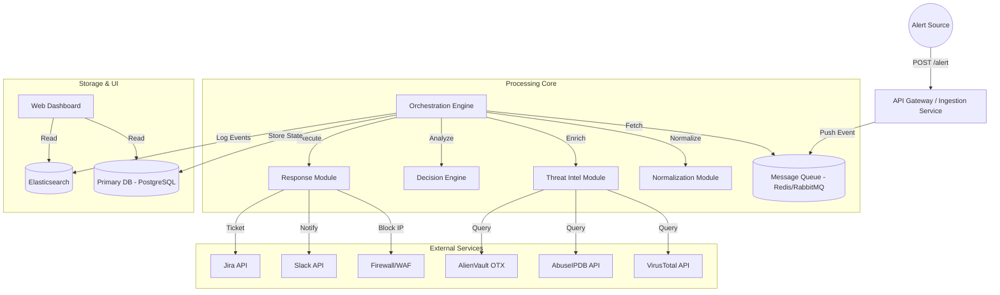
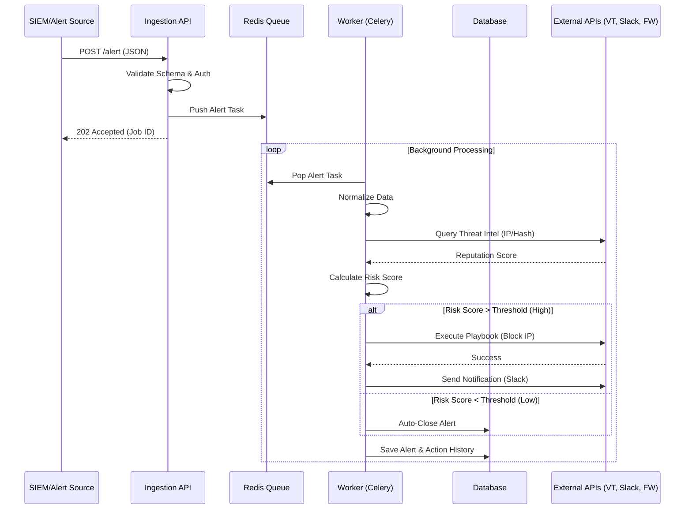
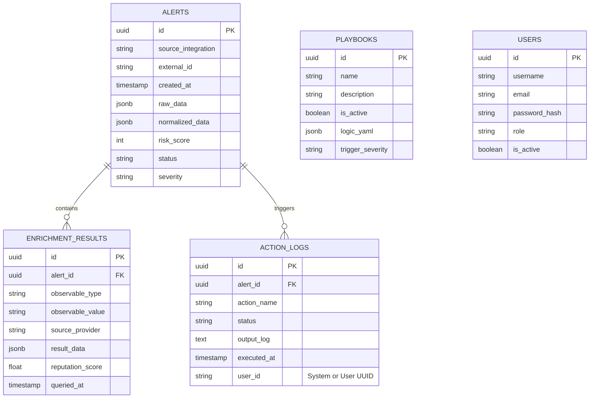

# Product Requirements Document (PRD)

## SOC Automation Bot (SOAR-Based Security Incident Automation System)

**Version:** 1.2
**Status:** In Development
**Last Updated:** 2026-02-15

---

## 1. Executive Summary

The **SOC Automation Bot** is a comprehensive Security Orchestration, Automation, and Response (SOAR) platform designed to streamline security operations. It automates the lifecycle of security incidents—from ingestion and enrichment to analysis and response. By reducing manual repetitive tasks, the system empowers SOC analysts to focus on high-value threat hunting and strategic defense. This PRD outlines the requirements for a robust, scalable, and secure automation bot suitable for both academic demonstration and small-to-medium enterprise (SME) deployment.

## 2. Problem Statement

Modern Security Operations Centers (SOCs) face "alert fatigue" due to the sheer volume of notifications from disparate security tools (SIEM, IDS/IPS, EDR).
Key challenges include:
*   **High Mean Time to Response (MTTR):** Manual data gathering and context switching slow down incident response.
*   **Inconsistent Analysis:** Different analysts may handle similar alerts differently.
*   **Burnout:** Repetitive Level-1 (L1) triage tasks lead to analyst fatigue and turnover.
*   **Lack of Integration:** Security tools often operate in silos, requiring manual data correlation.

## 3. Objectives & Key Results (OKRs)

### Objectives
1.  **Automate Triage:** Automatically ingest, normalize, and enrich 100% of supported alert types.
2.  **Standardize Response:** Implement consistent, rule-based responses for common threat scenarios (e.g., brute force, phishing, malware C2).
3.  **Enhance Visibility:** Provide a centralized dashboard for real-time incident tracking and reporting.
4.  **Scalability:** Design the system to handle a 50% year-over-year increase in alert volume without performance degradation.

### Key Success Metrics
*   **Reduction in MTTR:** < 2 minutes for automated containment actions.
*   **False Positive Reduction:** Auto-close > 30% of false positive alerts based on threat intel.
*   **System Uptime:** 99.9% availability during business hours.
*   **Analyst Efficiency:** Reduce L1 analyst workload by 40% (measured by tickets closed automatically vs manually).

---

## 4. Scope

### In Scope (MVP)
*   **Ingestion:** REST API for generic webhooks and specific connectors for 2 major SIEMs (Splunk, Wazuh).
*   **Enrichment:** Integration with:
    *   **VirusTotal** (File hashes, URLs)
    *   **AbuseIPDB** (IP Reputation)
    *   **AlienVault OTX** (Indicator matching)
    *   **Whois** (Domain registration info)
*   **Analysis:** Rule-based engine for risk scoring (0-100) and classification.
*   **Response:**
    *   **Network:** Block IP (Linux iptables / AWS Security Group).
    *   **Endpoint:** Isolate Host (Simulated API for MVP).
    *   **Identity:** Disable User (Active Directory/LDAP).
    *   **Notification:** Slack, Email (SMTP), Microsoft Teams.
*   **Case Management:** Create, update, and close tickets in an internal DB or external tool (Jira).
*   **Visualization:** Web-based dashboard for alert status, metrics, and topology.
*   **Audit Logging:** Comprehensive logging of all system actions for compliance.

### Out of Scope (Phase 1)
*   Custom machine learning models for anomaly detection (Rule-based only for MVP).
*   Evidence locker (Chain of Custody) for legal proceedings.
*   Multi-tenancy (Single organization focus).
*   Mobile Application.

---

## 5. System Architecture

The system follows a microservices-inspired, event-driven architecture to ensure scalability and resilience.

### High-Level Diagram



### Alert Processing Sequence



### Core Components
1.  **Ingestion Service (Flask/FastAPI):** Exposes REST endpoints to receive alerts. Validates API keys and payload schema. Handles rate limiting.
2.  **Message Queue (Redis):** Decouples ingestion from processing to handle alert spikes and ensure message delivery.
3.  **Orchestration Engine (Celery/Python):** The "brain" that coordinates the workflow (Normalize -> Enrich -> Analyze -> Respond). scales horizontally.
4.  **Decision Engine:** Evaluates normalized data against defined rules (YAML playbooks) to determine actions.
5.  **Database (PostgreSQL):** Stores structured alert data, playbook configurations, user profiles, and audit trails.
6.  **Logging (ELK Stack):** Centralized logging for system health and security audit.

---

## 6. Project Structure (Scaffolding)

The project will follow a modular Python structure, separating concerns between the API, worker, and shared libraries.

```
soc-automation-bot/
├── app/                        # Main application logic
│   ├── api/                    # Ingestion API Focus
│   │   ├── __init__.py
│   │   ├── main.py             # FastAPI entry point
│   │   ├── routes.py           # API Endpoints
│   │   ├── models.py           # Pydantic models for request validation
│   │   └── auth.py             # API Key validation logic
│   ├── core/                   # Core business logic
│   │   ├── __init__.py
│   │   ├── config.py           # Configuration management (Env vars)
│   │   ├── celery_app.py       # Celery configuration
│   │   └── tasks.py            # Celery task definitions (processing pipeline)
│   ├── modules/                # Pluggable modules
│   │   ├── ingestion/          # Parsers for different SIEMs (Splunk, Wazuh)
│   │   ├── normalization/      # Data normalization logic
│   │   ├── enrichment/         # Threat Intel integrations (VT, AbuseIPDB)
│   │   ├── analysis/           # Risk scoring and decision engine
│   │   └── response/           # Action execution (Firewall, Slack, Jira)
│   └── database/               # Database interaction
│       ├── __init__.py
│       ├── models.py           # SQLAlchemy ORM models
│       └── crud.py             # DB operations
├── tests/                      # Testing suite
│   ├── unit/
│   ├── integration/
│   └── conftest.py
├── scripts/                    # Utility scripts (db migration, setup)
├── docker-compose.yml          # Container orchestration
├── Dockerfile.api              # Dockerfile for API service
├── Dockerfile.worker           # Dockerfile for Celery worker
├── requirements.txt            # Python dependencies
├── alembic.ini                 # Database migration config
└── README.md                   # Project documentation
```

---

## 7. Data Models & Database Schema

### 7.1. Entity Relationship Diagram (ERD)



### 7.2. Database Schema (PostgreSQL DDL Draft)

```sql
-- Alerts Table
CREATE TABLE alerts (
    id UUID PRIMARY KEY DEFAULT gen_random_uuid(),
    source_integration VARCHAR(50) NOT NULL,
    external_id VARCHAR(100), -- ID from the source system
    created_at TIMESTAMP WITH TIME ZONE DEFAULT NOW(),
    updated_at TIMESTAMP WITH TIME ZONE DEFAULT NOW(),
    raw_data JSONB NOT NULL,
    normalized_data JSONB, -- Stores standard schema (src_ip, dest_ip, etc.)
    risk_score INTEGER CHECK (risk_score >= 0 AND risk_score <= 100),
    severity VARCHAR(20) CHECK (severity IN ('Info', 'Low', 'Medium', 'High', 'Critical')),
    status VARCHAR(20) DEFAULT 'New' CHECK (status IN ('New', 'InProgress', 'Closed', 'FalsePositive'))
);

-- Enrichment Results Table
CREATE TABLE enrichment_results (
    id UUID PRIMARY KEY DEFAULT gen_random_uuid(),
    alert_id UUID REFERENCES alerts(id) ON DELETE CASCADE,
    observable_type VARCHAR(50) NOT NULL, -- e.g., 'ip', 'domain', 'hash'
    observable_value TEXT NOT NULL,
    source_provider VARCHAR(50) NOT NULL, -- e.g., 'VirusTotal', 'AbuseIPDB'
    result_data JSONB, -- Full response from provider
    reputation_score FLOAT, -- Normalized score (0.0 - 1.0)
    queried_at TIMESTAMP WITH TIME ZONE DEFAULT NOW()
);

-- Actions Log Table
CREATE TABLE action_logs (
    id UUID PRIMARY KEY DEFAULT gen_random_uuid(),
    alert_id UUID REFERENCES alerts(id) ON DELETE CASCADE,
    playbook_id UUID REFERENCES playbooks(id),
    action_name VARCHAR(100) NOT NULL, -- e.g., 'block_ip_iptables'
    status VARCHAR(20) NOT NULL CHECK (status IN ('Pending', 'Success', 'Failure', 'Skipped')),
    output_log TEXT, -- stdout/stderr or API response
    executed_at TIMESTAMP WITH TIME ZONE DEFAULT NOW(),
    executed_by VARCHAR(100) DEFAULT 'system' -- 'system' or user_id
);

-- Playbooks Table
CREATE TABLE playbooks (
    id UUID PRIMARY KEY DEFAULT gen_random_uuid(),
    name VARCHAR(100) UNIQUE NOT NULL,
    description TEXT,
    is_active BOOLEAN DEFAULT TRUE,
    trigger_severity VARCHAR(20)[], -- Array of severities that trigger this
    steps_definition JSONB NOT NULL -- The logic defining the playbook
);

-- Users Table
CREATE TABLE users (
    id UUID PRIMARY KEY DEFAULT gen_random_uuid(),
    username VARCHAR(50) UNIQUE NOT NULL,
    email VARCHAR(100) UNIQUE NOT NULL,
    password_hash VARCHAR(255) NOT NULL,
    role VARCHAR(20) DEFAULT 'Analyst' CHECK (role IN ('Admin', 'Analyst', 'Auditor')),
    created_at TIMESTAMP WITH TIME ZONE DEFAULT NOW()
);
```

---

## 8. Functional Requirements

### 8.1. Alert Ingestion
*   **FR-1.1:** System MUST accept alerts via HTTPS POST requests.
*   **FR-1.2:** System MUST authenticate sources using API Keys (Bearer Token) or Mutual TLS.
*   **FR-1.3:** System MUST support identifying the source tool (e.g., source="Wazuh", source="Splunk").
*   **FR-1.4:** System MUST validate JSON payloads against a predefined schema and reject invalid requests with HTTP 400.
*   **FR-1.5:** System MUST support a generic webhook endpoint for unsupported tools.

### 8.2. Normalization
*   **FR-2.1:** System MUST map vendor-specific fields (e.g., `src_ip`, `sourceAddress`, `ip_address`) to a standardized internal schema based on the Cyber Evasion & Countermeasure (CEC) or STIX 2.1 standard.
*   **FR-2.2:** System MUST handle missing fields gracefully by marking them as `null` or `unknown`.
*   **FR-2.3:** System MUST normalize timestamps to UTC ISO-8601 format.

### 8.3. Threat Intelligence Enrichment
*   **FR-3.1:** System MUST automatically extract observables (IPs, Domains, Hashes, URLs) from the alert.
*   **FR-3.2:** System MUST query configured Threat Intel Providers (TIPs) for reputation scores.
*   **FR-3.3:** System MUST implement caching (TTL: 24h) for TIP responses to minimize API usage and costs.
*   **FR-3.4:** System MUST support "allow-listing" for known internal IPs/Domains to prevent unnecessary external queries.

### 8.4. Decision Engine & Analysis
*   **FR-4.1:** System MUST calculate an `Aggregate Risk Score` (0-100) based on:
    *   Initial severity provided by the source.
    *   Threat Intel reputation (e.g., VirusTotal > 5 engines detected).
    *   Asset Criticality (if asset DB is available).
    *   Number of previous occurrences (deduplication/aggregation).
*   **FR-4.2:** System MUST classify alerts into:
    *   `Info` (Score < 20)
    *   `Low` (20-40)
    *   `Medium` (40-70)
    *   `High` (70-90)
    *   `Critical` (> 90)
*   **FR-4.3:** System MUST support logical rules in playbooks (AND, OR, NOT conditions).

### 8.5. Automated Response (Playbooks)
*   **FR-5.1:** System MUST execute predefined playbooks based on Alert Class and Severity.
*   **FR-5.2:** Supported actions:
    *   **Block IP:** Add `iptables` rule, update AWS Security Group, or call Firewall API (Palo Alto/Fortinet).
    *   **Disable User:** Lock Active Directory account (via LDAP/API).
    *   **Isolate Machine:** Trigger EDR isolation API.
    *   **Notify:** Send formatted message to Slack/Teams channel.
    *   **Ticket:** Create Jira/ServiceNow ticket with alert details.
*   **FR-5.3:** System MUST support "Human-in-the-Loop" for high-impact actions (e.g., blocking a critical server IP requirements analyst approval via Slack button).
*   **FR-5.4:** System MUST record the outcome of every action (Success/Failure) in the audit log.

### 8.6. Dashboard & Reporting
*   **FR-6.1:** Web UI MUST display:
    *   **Overview Dashboard:** Active alerts, threats by type, system health.
    *   **Alert/Case View:** Detailed view of a specific alert including raw data, normalized data, enrichment results, and automated actions taken.
    *   **Metrics:** Alerts Per Day, Top Attack Sources, MTTR, False Positive Rate.
*   **FR-6.2:** System MUST allow analysts to manual trigger playbooks or close alerts.
*   **FR-6.3:** System MUST provide a search interface to query historical alerts by IP, Hash, or Time range.

### 8.7. System Management
*   **FR-7.1:** Admins MUST be able to configure API keys for external services (TIPs, Firewalls) via the UI or secure config file.
*   **FR-7.2:** Admins MUST be able to view and retry failed automation jobs.

---

## 9. Non-Functional Requirements

### 9.1. Performance
*   **Ingestion Latency:** < 200ms for API response.
*   **Processing Time:** < 5 seconds from ingestion to notification (excluding external API delays).
*   **Throughput:** Capable of handling 100 alerts/minute continuously.

### 9.2. Security
*   **Validation:** Strict input validation to prevent Injection attacks in the bot itself.
*   **Encryption:** TLS 1.2+ for all data in transit. AES-256 for sensitive data at rest (API Keys, Database).
*   **Access Control:** Role-Based Access Control (RBAC) for the Dashboard (Admin vs. Analyst vs. Auditor).
*   **Secrets Management:** No hardcoded credentials. Use Environment Variables or Vault.

### 9.3. Reliability
*   **Retry Logic:** Exponential backoff for failed external API calls (max 3 retries).
*   **Persistence:** No data loss if the processing worker crashes (Redis AOF enabled).
*   **Monitoring:** Health check endpoints (`/health`) for liveness and readiness probes.

---

## 10. Technology Stack

| Component | Technology | Rationale |
| :--- | :--- | :--- |
| **Backend Framework** | Python (FastAPI) | High performance (async), auto-generated Swagger UI, strong typing. |
| **Task Queue** | Celery + Redis | Standard for Python background tasks; supports periodic tasks (Cron). |
| **Database** | PostgreSQL | Reliability, complex querying, JSONB support for flexible schemas. |
| **Frontend** | React (Next.js) + TailwindCSS | Modern, component-based, fast development, responsive design. |
| **Visualization** | Recharts / Chart.js | JavaScript libraries defined for React integration. |
| **Containerization** | Docker & Docker Compose | Simplified deployment and dependency management. |
| **Testing** | Pytest (Backend), Jest (Frontend) | Standard testing frameworks. |

---

## 11. API Specification (Core Endpoints)

### `POST /api/v1/alert`
Ingests a new security alert.
*   **Auth:** Bearer Token
*   **Body:** JSON (Flexible schema)
*   **Response:** `202 Accepted` (`{"job_id": "..."}`)

### `GET /api/v1/alerts`
Retrieves a paginated list of alerts.
*   **Query Params:** `page`, `limit`, `status`, `severity`, `date_start`, `date_end`.
*   **Response:** `200 OK` (List of Alerts)

### `GET /api/v1/alerts/{alert_id}`
Retrieves full details of a specific alert.

### `POST /api/v1/alerts/{alert_id}/actions/{action_name}`
Manually trigger an action (e.g., "block_ip") on an alert.
*   **Body:** `{"parameters": {...}}`

---

## 12. Roadmap

### Phase 1: Foundation (Current MVP)
*   Basic ingestion API & Queuing.
*   Integration with VirusTotal & AbuseIPDB.
*   Slack Notifications.
*   Simple "Block IP" action for Linux Firewall.
*   Basic React Dashboard (Alert List).

### Phase 2: Intelligence & Orchestration
*   Complex Playbook builder (YAML/Visual).
*   Human-in-the-loop approval workflows.
*   Jira Integration for ticketing.
*   Asset Criticality database.

### Phase 3: Advanced Capabilities
*   Historical correlation (finding patterns over time).
*   MITRE ATT&CK framework mapping.
*   Multi-tenancy support for MSSPs.
*   Machine Learning for "Unknown" threats.

---

## 13. Risks & Mitigation

| Risk | Impact | Mitigation Strategy |
| :--- | :--- | :--- |
| **API Rate Limits** | High | Implement local caching (Redis) and global rate limiting on outbound requests. |
| **False Positive Blocking** | Critical | Default to "Notify Only" mode for first 2 weeks; use whitelists (Google bots, Internal IPs). |
| **Credential Leakage** | Critical | Use `.env` files and Secrets Management; scan code for secrets before commit. |
| **Worker Failure** | Medium | Run multiple worker instances; monitor queue depth. |

## 14. Glossary

*   **IOC (Indicator of Compromise):** Artifacts observed on a network or in an operating system that indicate a computer intrusion (e.g., File Hash, IP).
*   **SOAR:** Security Orchestration, Automation, and Response.
*   **TTP:** Tactics, Techniques, and Procedures.
*   **SIEM:** Security Information and Event Management.
*   **Playbook:** A set of predefined actions to handle a specific type of incident.
